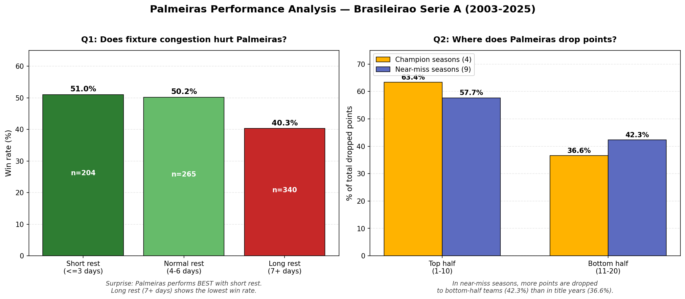

# Overview

Soccer clubs increasingly rely on data to make decisions — from squad selection to tactical adjustments. This project analyzes 22 seasons of the Campeonato Brasileiro de Futebol (9,165 matches, 2003–2025) to answer two questions about Sociedade Esportiva Palmeiras that real club analytics departments actually investigate: whether fixture congestion affects performance, and where title-contending teams lose points they shouldn't. Both findings ended up challenging the original hypotheses.

[Software Demo Video](http://youtube.link.goes.here)

# Data Analysis Results

### Question 1: Does fixture congestion hurt Palmeiras?

Surprisingly, no. Palmeiras' win rate is virtually identical with short rest (≤3 days, 51.0%) and normal rest (4–6 days, 50.2%), but drops sharply with long rest (7+ days, 40.3%). This contradicts the common narrative that congested fixtures hurt performance. A plausible explanation is that long rest periods often coincide with international breaks or post-Libertadores recovery — periods where the team loses key players to national teams or has its rhythm disrupted. The data suggests Palmeiras performs best when in continuous match rhythm, not when rested.

### Question 2: Where does Palmeiras drop points they shouldn't?

In Palmeiras' near-miss seasons (finishing 2nd–4th, 9 seasons total), 42.3% of dropped points came from matches against bottom-half opponents. In championship seasons (4 seasons), that figure dropped to 36.6%. Even more striking, the loss rate against bottom-half teams was 44% in near-miss seasons compared to just 30% in title-winning seasons. The data supports the theory that championships in the Brazilian league are decided more by avoiding upsets against weaker teams than by results in marquee matches against direct rivals.

### Visualization

Both findings are presented as a side-by-side bar chart saved to `output/palmeiras_analysis.png`. The left chart shows win rate by rest category; the right chart shows the distribution of dropped points by opponent strength, split between champion and near-miss seasons. Each bar is annotated with percentages and sample sizes.



# Definitions and Assumptions

* **Title contender season:** Any season where Palmeiras finished 1st–4th in the final Brasileirão table. 1st place = Champion; 2nd–4th = Near-miss.
* **Bottom-half opponent:** Any team that finished in positions 11–20 in the final standings of that specific season. Top-half is positions 1–10.
* **Rest buckets:** Calculated as calendar days between consecutive Palmeiras *Brasileirão* matches only. Short rest = ≤3 days, Normal rest = 4–6 days, Long rest = 7+ days. Note: matches played in Copa do Brasil, Copa Libertadores, or other competitions between two league fixtures are not in this dataset, so rest days may be understated.

# How to Run

```powershell
git clone https://github.com/herbertmoroni/verdao-analytics.git
cd verdao-analytics
python -m venv .venv
.venv\Scripts\Activate.ps1
pip install -r requirements.txt

python src/q1_fixture_congestion.py   # Q1 results in terminal
python src/q2_dropped_points.py       # Q2 results in terminal
python src/q3_visualize.py            # generates output/palmeiras_analysis.png
```

# Development Environment

The software was developed in Visual Studio Code on Windows, using Python 3.13 and an isolated virtual environment (venv) to keep dependencies reproducible across machines. Git and GitHub were used for version control.

The programming language is Python. The main libraries used are:

* Pandas — for loading the CSV, filtering, sorting, datetime conversion, grouping, aggregation, and joining derived standings back to the match data
* Matplotlib — for producing the side-by-side bar chart that visualizes both findings
* NumPy — used indirectly by Pandas and Matplotlib for numerical operations

# Useful Websites

* [Pandas — Getting Started Tutorials](https://pandas.pydata.org/docs/getting_started/index.html)
* [Pandas — 10 Minutes to Pandas](https://pandas.pydata.org/docs/user_guide/10min.html)
* [Matplotlib — Pyplot Tutorial](https://matplotlib.org/stable/tutorials/pyplot.html)
* [Kaggle — Campeonato Brasileiro de Futebol Dataset](https://www.kaggle.com/datasets/adaoduque/campeonato-brasileiro-de-futebol)
* [Real Python — Working with Date and Time in Pandas](https://realpython.com/pandas-python-explore-dataset/)

# Future Work

* Address the hidden-matches limitation in Question 1 by combining the Brasileirão dataset with cup and continental match data (Copa do Brasil, Copa Libertadores, Mundial, Paulistão) to calculate true rest days across all competitions, not just league fixtures
* Address the hindsight-bias limitation in Question 2 by calculating standings at the time of each match rather than using final season standings, giving a more accurate classification of opponent strength at the moment each match was played
* Investigate fixture congestion in more depth — specifically whether consecutive short-rest matches compound (2 in a row may be fine, but 3, 4, or 5 back-to-back games with ≤3 days rest could reveal a fatigue threshold the current analysis misses)
* Separate "long rest" matches into international break gaps vs. natural calendar gaps, to better understand why long rest correlates with worse performance
* Add statistical significance testing (chi-square or t-test) to confirm whether the observed differences are statistically meaningful or could be noise

### New questions the dataset could answer:

* **Manager impact:** Does Palmeiras' performance under Abel Ferreira differ measurably from previous managers, controlling for opponent strength?
* **Formation effectiveness:** Using the `formacao_mandante` column, which tactical formations produce the best results, and does the optimal formation change against stronger vs. weaker opposition?
* **Home advantage erosion:** Has the gap between home and away win rates shrunk over 22 years of Brazilian football, and how does Palmeiras compare to the league average?
* **The "Allianz effect":** Did Palmeiras' home performance change after moving from Estádio Palestra Itália to Allianz Parque in 2014?
* **Derby specialists:** Is there a measurable difference in performance against São Paulo state rivals (Corinthians, São Paulo, Santos) versus other top-half teams?
* **Comeback ability:** Using goal data from the related dataset, how often does Palmeiras win when conceding first, and has this changed over time?

# AI Disclosure

I used AI to help structure my Pandas code, especially around the standings calculation in Question 2. Building a final league table from raw match results required combining home and away matches into a single long-format DataFrame, grouping by season and team, and ranking within each season — none of which I had done before. AI helped me understand the groupby + rank pattern and walked me through why a long-format DataFrame was easier to work with than trying to handle home and away separately.

I also asked for help with the date conversion logic. The dataset stores dates as strings in DD/MM/YYYY format, which Pandas was sorting alphabetically rather than chronologically. Once I caught the issue (my "first match" was in 2021 instead of 2003), AI helped me apply pd.to_datetime with the correct format string — a small fix, but a meaningful lesson in always inspecting data types before trusting them.

For the Matplotlib chart, AI helped me with the side-by-side subplot layout, the grouped bar chart pattern for Question 2, and the annotation logic that places percentage labels above each bar. I refined the colors, captions, and overall styling iteratively until the chart told the story clearly.

Throughout the project, I followed the scientific method as a guiding principle: forming a hypothesis before each question, testing it with code, and recording the outcome — even when (especially when) the data contradicted my hypothesis.

I can explain every line of the final code and justify the analytical decisions.

Since English is not my first language (Portuguese is my native language), I also used AI to proofread the README.

# Limitations

* Hindsight bias in opponent classification: Question 2 classifies opponents as "top half" or "bottom half" based on each team's final position in that season. This means a team that started strongly but collapsed in the second half of the season is classified as bottom-half for the entire year, even for matches played early when they were performing well. A more rigorous version of this analysis would use the standings at the time of each match. The current approach is a reasonable approximation but introduces a small amount of hindsight bias that should be acknowledged.

* Hidden matches between Brasileirão fixtures: This dataset only contains Brasileirão matches, but Palmeiras also plays in Copa do Brasil, Copa Libertadores, Mundial, and state championships. When calculating "days of rest" between matches, the script measures gaps between league matches only — meaning a 7-day gap in the data might actually contain a midweek cup match the dataset doesn't include. So "long rest" in this analysis often signals teams playing other competitions, not teams that were truly rested. This may help explain Question 1's surprising finding that long rest correlates with worse performance: those gaps frequently coincide with parallel campaigns in continental tournaments.
